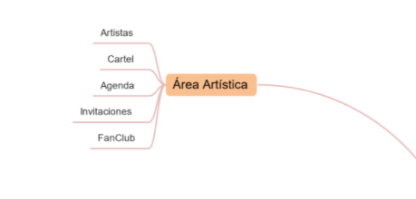

## INTRODUCCIÓN

El proyecto a realizar se basa en la creación de una base de datos que aborde el Área Artísticas del gran QuevedoFest. La crearemos y dessarrollaremos en PostgreSQL con el usuario Javier.

Dicha base de datos gestionará diversos aspectos del festival mediante numerosas tablas de datos, así como los festivales que se celebran, sus carteles, los artistas que asisten y sus mánagers, las entradas vendidas, el club de fans, los clientes y los escenarios donde se celebrarán los conciertos.

El desarrollo de la base de datos irá evolucionando por etapas:   

Lo primero a realizar es el modelo conceptual, es decir, llevar acabo el desarrollo de una estructura mediante un esquema conceptual. En él se indicarán las especificaciones de nuestra base de datos y se hará el diagrama Entidad-Relación de nuestra base de datos, indicando la cardinalidad y la relación entre las distintas tablas. 

En el segundo paso hablaremos sobre el modelo lógico, que establece una estructura sobre los datos independientemente de su almacenamiento. Enfocaremos el modelo relacional y la normalización de las tablas.  

Como último modelo a explicar tenemos el físico, en el que crearemos las tablas, diseñaremos el diagrama de la base de datos y cargaremos diversos datos de prueba. Dicho modelo representa como se construirá la base de datos. 

Otro apartado a tratar es el de consultas, donde se reflejarán las más frecuentes, las más sencillas y las subconsultas, entre otras. Nos interesará saber, por ejemplo, cuántos festivales y en qué fechas acontecen, el número de carteles que ofrecen, las entradas vendidas y su recaudación total, el número de espectadores o clientes que asisten, los artistas que asisten y pertenecen a cada cartel (y su sueldo), la gestión de los clubes de fans... 

Relacionado con lo anterior, también tendremos un espacio de vistas, secuencias, indices y scripts en PL/pgSQL, que automatizarán ciertas partes de algunas consultas.

Los últimos aspectos que tendremos en cuenta serán la creación de un prototipo de interfaz de usuario mediante AppInventor, un diagrama de clases de las tablas en Plant UML y el diseño de un plan de pruebas realizadas sobre nuestra base de datos en formato md y Gherkin.