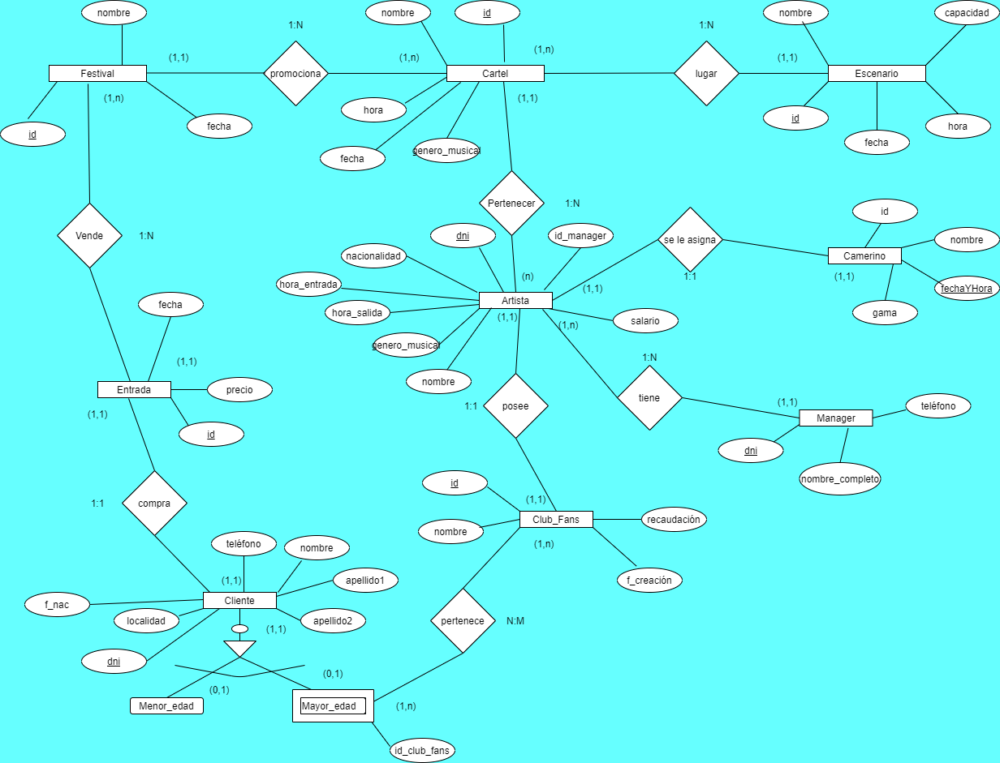

## 2.2 DIAGRAMA ENTIDAD-RELACIÓN

Este tipo de diagrama es una herramienta enfocada al modelado de datos que permite representar o destacar las entidades importantes que componen una Base de Datos, indicando las relaciones entre estas y sus propiedades o atributos.  

El diagrama Entidad-Relación del Área Artística del QuevedoFest es el siguiente:

