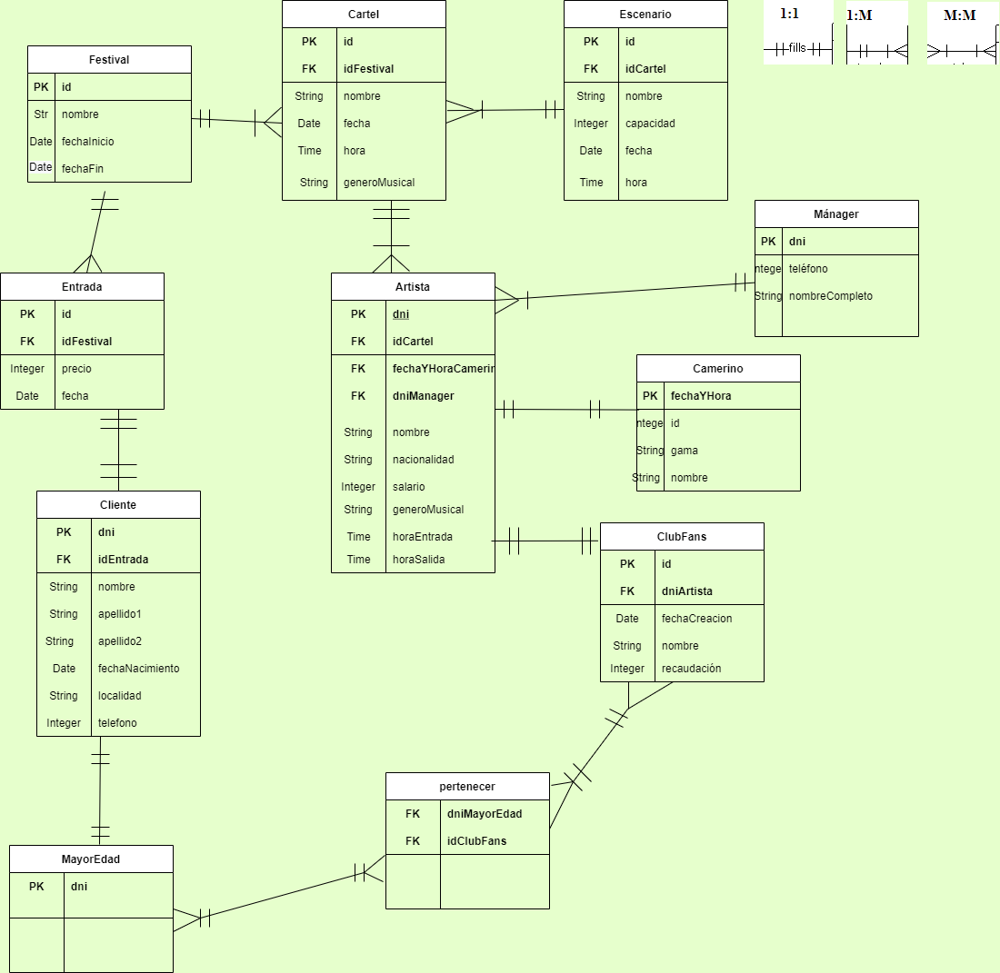

## 4.1 DIAGRAMA _CROW'S FEET_ O _IDEF1X_

El diagrama IDEF1X facilita la representación gráfica del diseño conseguido mediante el [modelo Entidad Relación](https://github.com/jmm-1999/QuevedoFest/blob/master/Documentos/2-ModeloConceptual/2.2-DiagramaEntidadRelacion.md). Otros diagramas similares a este son el UML (Lenguaje Unificado de Modelado) y el ORM (Modelado de Objetos), entre otros.  

El diagrama Corws's Feet de nuestra base de datos es el siguiente (Se incorpora una pequeña leyenda en el margen superior derecho):

