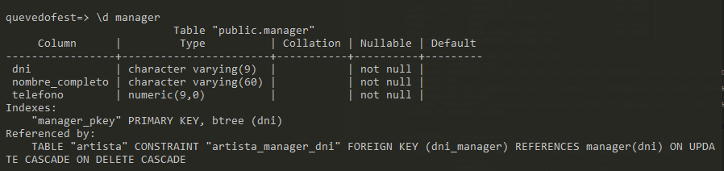

## 4.3 CARGA DE DATOS DE PRUEBA

En este apartado vamos a tratar de introducir un conjunto de valores o datos en nuestra BBDD.  
Introduciremos 3 festivales, 4 carteles en cada uno y 5 escenarios posibles para su celebración. También venderemos 5 entradas a 5 clientes distintos, de los cuales tres de ellos serán mayores de edad y dos pertenecerán a un club de fans.  
Contaremos con dos o tres artistas por cartel como mínimo, y cada uno tendrá un camerino a una hora determinada y un mánager asignado.

[Pulsa aquí para ver el fichero SQL](https://github.com/jmm-1999/QuevedoFest/blob/master/SQL/InsercionDatos.sql)

