## 8.4 DIAGRAMA DE CLASES DE LA BASE DE DATOS

En el campo de desarrollo de software, un diagrama de clases en Lenguaje Unificado de Modelado (UML) es un esquema gráfico que describe la estructura de un software o programa (en nuestro caso una base de datos) mostrando sus clases, atributos, operaciones o métodos y las relaciones entre las distintas entidades.

El diagrama de clases se desarrolla en PlantUML. [Pincha aquí para ver el fichero](https://github.com/jmm-1999/QuevedoFest/blob/master/PUML/AreaArtistica.puml)

```plantuml
@startuml
'https://plantuml.com/sequence-diagram

left to right direction

rectangle ÁreaArtística {
    class Festival {
        - id: Integer
        - nombre: String
        - fechaInicio: Timestamp
        - fechaFin: Timestamp
        +cancelar_festival(integer id)
    }

    class Cartel {
        -id: Integer
        -idFestival: Integer
        -nombre: String
        -fecha: Date
        -hora: Time
        -géneroMusical: GéneroMusical
        +cambio_actuacion(integer id, time horas)
    }

    class Escenario {
        -id: Integer
        -idCartel: Integer
        -nombre: String
        -capacidad: Integer
        -fecha: Date
        -hora: Time
    }

    class Entrada {
        -id: Integer
        -idFestival: Integer
        -precio: Integer
        -fecha: Timestamp
        +menor_precio_entradas(integer id)
        +mayor_precio_entradas(integer id)
        +nueva_entrada(integer id)
    }

    class Cliente {
        -dni: String
        -idEntrada: Integer
        -nombre: String
        -apellido1: String
        -apellido2: String
        -fechaNacimiento: Date
        -localidad: String
        -teléfono: String
        +borrar_asistente(String dni)
    }

    class MayorEdad {
        -dni: String
    }

    class Pertenecer {
        -dniMayorEdad: String
        -idClubFans: Integer
        +baja_clubFans(String dni)
    }

    class ClubFans {
        -id: Integer
        -dniArtista: String
        -fechaCreación: Date
        -nombre: String
        -recaudación: Integer
    }

    class Artista {
        -dni: String
        -idCartel: Integer
        -fechaYHoraCamerino: Timestamp
        -dniManager: String
        -nombre: String
        -nacionalidad: String
        -salario: Integer
        -géneroMusical: GéneroMusical
        -horaEntrada: Time
        -horaSalida: Time
        +actuacion_artista(String dni)
        +clasificacion_sueldo_artista(String dni)
    }

    class Camerino {
        -fechaYHora: Timestamp
        -id: Integer
        -gama: String
        -nombre: String
    }

    class Mánager {
        -dni: String
        -teléfono: String
        -nombreCompleto: String
    }

    enum GéneroMusical <<enumeration>> {
        Trap
        Rock
        Reggaetón
        Hardcore
        Flamenco
        Bachata
        Pop
        Punky
        Reggae
        Rap
    }

    Festival "1" *-- "N" Cartel: promociona
    Cartel "N" --* "1" Escenario: se da en
    Festival "1" *-- "N" Entrada: vende
    Entrada "1" -- "1" Cliente: compra
    Cliente <|-- MayorEdad
    MayorEdad "1..N" o-- "0..N" Pertenecer
    Pertenecer "N" --o "N" ClubFans
    ClubFans "1" -- "1" Artista
    Artista "1" -- "1" Camerino
    Artista "N" -- "1" Mánager
}
@enduml
```

